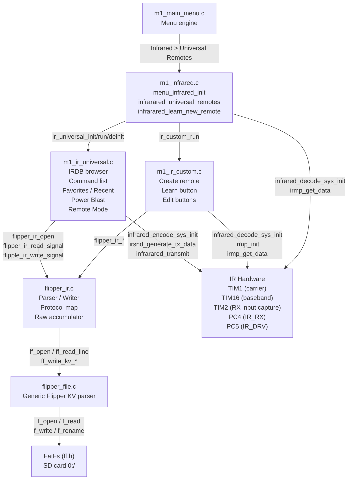
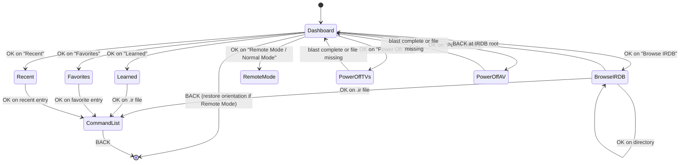

# Design Document: Universal Remote

## Overview

This document describes the technical design for the Universal Remote feature on the M1 T-1000 device. The feature ports Flipper Zero's Universal IR Remote functionality to the M1 firmware, leveraging the existing IR hardware (irmp/irsnd on TIM1/TIM2/TIM16), the FAT filesystem (FatFs via `ff.h`), and the established Flipper file format parser infrastructure already present in the codebase.

The implementation is organized around three source-file modules that already exist in partial form and need to be completed to close the gap between the current state and the full spec:

| Module | File | Responsibility |
|--------|------|----------------|
| Parser | `m1_csrc/flipper_ir.c` / `flipper_ir.h` | `.ir` file read/write, protocol mapping, raw accumulator |
| Universal Remote | `m1_csrc/m1_ir_universal.c` / `m1_ir_universal.h` | IRDB browser, command list, power blast, Remote Mode, favorites, recent |
| Custom Remote | `m1_csrc/m1_ir_custom.c` / `m1_ir_custom.h` | Create, learn, edit (rename/delete) custom remotes |
| IR Core | `m1_csrc/m1_infrared.c` / `m1_infrared.h` | Signal learn (IRDB save), TX/RX hardware init/deinit |

All of this code is behind the `M1_APP_FILE_IMPORT_ENABLE` compile-time guard. All file I/O uses FatFs. All Flipper file operations use stack allocation only — no heap, no `m1_malloc`.

---

## Architecture

### Module Interaction



### FreeRTOS Event Flow

All UI screens block on `xQueueReceive(main_q_hdl, &q_item, portMAX_DELAY)`. Button events arrive as `Q_EVENT_KEYPAD` items, IR RX edge events as `Q_EVENT_IRRED_RX`, and TX completion as `Q_EVENT_IRRED_TX`. Each screen function calls `xQueueReset(main_q_hdl)` immediately before returning to prevent stale events leaking to the parent screen.

### SD Card Directory Layout

```
0:/
├── IR/
│   ├── TV/
│   │   └── Universal_Power.ir
│   ├── Audio/
│   │   └── Universal_Power.ir
│   ├── Projector/
│   │   └── Universal_Projector.ir
│   ├── Learned/
│   │   └── remote_001.ir ... remote_999.ir
│   ├── <custom_remote_name>.ir   (root-level .ir files = custom remotes)
│   └── <Category>/
│       └── <Brand>/
│           └── <Device>.ir
└── System/
    ├── ir_favorites.txt
    └── ir_recent.txt
```

---

## Components and Interfaces

### flipper_ir.c / flipper_ir.h (Parser)

This layer is already substantially complete. Key functions:

```c
/* File lifecycle */
bool flipper_ir_open(flipper_file_t *ctx, const char *path);
bool flipper_ir_open_append(flipper_file_t *ctx, const char *path);
bool flipper_ir_write_header(flipper_file_t *ctx);

/* Signal I/O */
bool flipper_ir_read_signal(flipper_file_t *ctx, flipper_ir_signal_t *out);
bool flipper_ir_write_signal(flipper_file_t *ctx, const flipper_ir_signal_t *sig);

/* Bulk rewrite (for rename/delete): streams all signals through a callback
   into a temp file, then atomically replaces the original */
bool flipper_ir_rewrite(const char *path, flipper_ir_rewrite_cb_t cb, void *user);

/* Convenience wrappers built on flipper_ir_rewrite */
bool flipper_ir_rename_signal(const char *path, uint16_t index, const char *new_name);
bool flipper_ir_delete_signal(const char *path, uint16_t index);

/* Protocol name ↔ IRMP ID mapping */
uint8_t     flipper_ir_proto_to_irmp(const char *name);
const char *flipper_ir_irmp_to_proto(uint8_t irmp_id);

/* Raw accumulator — used when IRMP cannot decode a signal */
void                      flipper_ir_raw_begin(flipper_ir_signal_t *sig, const char *name);
bool                      flipper_ir_raw_add_edge(flipper_ir_signal_t *sig, uint32_t us, bool is_mark);
bool                      flipper_ir_raw_finish(flipper_ir_signal_t *sig, uint32_t freq, float dc);
flipper_ir_raw_feed_result_t flipper_ir_raw_feed(flipper_ir_signal_t *sig,
    uint32_t us, bool is_mark, bool frame_end,
    uint16_t min_samples, uint32_t freq, float dc);

/* Count without loading all data */
uint16_t flipper_ir_count_signals(const char *path);
```

**Signal type** (`flipper_ir_signal_t`):

```c
typedef struct {
    char name[32];
    flipper_ir_signal_type_t type;  /* PARSED or RAW */
    bool valid;
    union {
        struct { uint8_t protocol; uint16_t address; uint16_t command; uint8_t flags; } parsed;
        struct { uint32_t frequency; float duty_cycle;
                 int32_t samples[512]; uint16_t sample_count; } raw;
    };
} flipper_ir_signal_t;
```

**Protocol mapping table** (`ir_proto_table[]` in `flipper_ir.c`):

| Flipper Name | IRMP Protocol ID |
|---|---|
| NEC, NECext, Pioneer | `IRMP_NEC_PROTOCOL` (2) |
| NEC42 | `IRMP_NEC42_PROTOCOL` (28) |
| NEC16 | `IRMP_NEC16_PROTOCOL` (27) |
| Samsung32, Samsung | `IRMP_SAMSUNG32_PROTOCOL` (10) |
| Samsung48 | `IRMP_SAMSUNG48_PROTOCOL` (41) |
| RC5, RC5X | `IRMP_RC5_PROTOCOL` (7) |
| RC6 | `IRMP_RC6_PROTOCOL` (9) |
| SIRC, SIRC15, SIRC20 | `IRMP_SIRCS_PROTOCOL` (1) |
| Kaseikyo, Panasonic | `IRMP_KASEIKYO_PROTOCOL` (5) |
| RCA | `IRMP_RCCAR_PROTOCOL` (19) |
| Denon, Sharp | `IRMP_DENON_PROTOCOL` (8) |
| JVC | `IRMP_JVC_PROTOCOL` (20) |
| LG | `IRMP_LGAIR_PROTOCOL` (40) |
| Apple | `IRMP_APPLE_PROTOCOL` (11) |
| Nokia | `IRMP_NOKIA_PROTOCOL` (16) |
| Bose | `IRMP_BOSE_PROTOCOL` (31) |
| RCMM | `IRMP_RCMM32_PROTOCOL` (36) |

**Design decision — alias round-trip**: Several Flipper names (e.g., `NECext`, `Pioneer`, `RC5X`, `Panasonic`, `Sharp`) map to the same IRMP ID as another Flipper name. The reverse mapping (`flipper_ir_irmp_to_proto`) returns the *first* matching entry in `ir_proto_table`, which is the canonical name. Round-tripping an alias (e.g., `NECext` → IRMP 2 → `NEC`) is acceptable per requirement 2.4.

### m1_ir_universal.c / m1_ir_universal.h (IRDB Browser + Universal Remote)

**Public interface**:

```c
void ir_universal_run(void);          /* entry from m1_infrared.c */
void ir_universal_init(void);         /* load favorites, recent; mkdir */
void ir_universal_deinit(void);       /* save favorites, recent */
void ir_replay_file(const char *path); /* shared command-list view */
```

**Key internal state** (module-static):

```c
static ir_universal_cmd_t  s_commands[IR_UNIVERSAL_MAX_CMDS];  /* 64 */
static uint16_t            s_cmd_count;
static char                s_browse_names[16][64];
static char                s_current_path[256];
static char                s_favorites[10][256];
static uint8_t             s_favorite_count;
static char                s_recent[10][256];
static uint8_t             s_recent_count;
```

**Screen flow**:



**Favorites / Recent management**: Both lists are plain-text files, one path per line. `load_favorites()` and `load_recent()` read at init; `save_favorites()` and `save_recent()` write at deinit. The Recent list enforces deduplication: before prepending a path, it is searched; if found, the existing entry is removed first, then the path is prepended. Both lists cap at 10 entries; when the cap would be exceeded, the last entry is evicted before prepending.

**Power Blast**: `ir_power_blast(title, paths[], n_paths)` opens each file in turn, iterates all signals with `flipper_ir_read_signal()`, calls `irsnd_generate_tx_data()` + `infrared_transmit()` per signal, calls `m1_watchdog_feed()` between signals, and handles missing files with a brief on-screen message before continuing to the next file.

**Remote Mode toggle**: The dashboard item label switches between `"Remote Mode"` and `"Normal Mode"` based on `m1_screen_orientation`. Setting Remote Mode sets `m1_screen_orientation = M1_ORIENT_REMOTE` and `u8g2_SetDisplayRotation(&m1_u8g2, U8G2_R1)`. Restoring Normal Mode sets `M1_ORIENT_NORMAL` and `U8G2_R2`, but only if the current orientation is `M1_ORIENT_REMOTE` (idempotent: if already normal, no-op). On BACK from the dashboard, the orientation is restored to `M1_ORIENT_NORMAL`, *unless* the pre-entry orientation was `M1_ORIENT_SOUTHPAW`, in which case it is restored to `M1_ORIENT_SOUTHPAW` + `U8G2_R0`.

### m1_ir_custom.c / m1_ir_custom.h (Custom Remotes)

**Public interface**:

```c
void ir_custom_run(void);  /* entry from m1_infrared submenu */
```

**Key internal functions** (all static):

```c
static void ir_custom_sanitize_name(const char *in, char *out, size_t out_len);
static bool ir_custom_unique_path(const char *name, char *out, size_t out_len);
static bool ir_custom_create_empty(const char *name, char *out_path, size_t out_len);
static void ir_custom_learn_button(const char *path);
static void ir_custom_scan_buttons(const char *path);
static bool ir_custom_rename_button(const char *path, uint16_t index);
static void ir_custom_edit_buttons(const char *path, const char *name);
static bool ir_custom_append_parsed(const char *path, const IRMP_DATA *data);
static bool ir_custom_append_raw(const char *path, flipper_ir_signal_t *sig);
```

**Name sanitization rules** (`ir_custom_sanitize_name`):

1. Control characters (< 0x20) → `_`
2. Path separators `/`, `\` → `_`
3. FAT-reserved characters `*`, `?`, `"`, `<`, `>`, `|`, `:` → `_`
4. Trailing spaces and dots are trimmed
5. If the result is empty, fall back to `"Remote"`

**Deduplication**: `ir_custom_unique_path` tries `0:/IR/<name>.ir` first; if it exists, tries `0:/IR/<name>_1.ir`, `_2`, ..., `_99`. Returns false if all 99 suffixes are taken.

**Atomic rewrite** for rename/delete: `flipper_ir_rewrite()` writes to `<path>.tmp`, then `f_unlink(path)` + `f_rename(tmp, path)`. On any failure the temp file is unlinked and the original is preserved.

**Learn button flow**: The IRMP decoder is initialized with `infrared_decode_sys_init()` + `irmp_init()`. Each `Q_EVENT_IRRED_RX` event feeds both `irmp_data_sampler(te, dir)` (for IRMP decode attempt) and `flipper_ir_raw_feed()` (for raw accumulation). The first successful `irmp_get_data()` wins and locks `cap = IR_CAP_PARSED`; if IRMP never decodes but a `FLIPPER_IR_RAW_FRAME_COMPLETE` result is returned, `cap = IR_CAP_RAW`. On BACK, `infrared_decode_sys_deinit()` is called and the file is not touched.

### m1_infrared.c (IR Core — Learn new remote path)

The existing `infrared_learn_new_remote()` already handles IRMP decode, display, and file-save via `ir_save_learned_signal()`. The save path uses `flipper_ir_write_header()` + `flipper_ir_write_signal()` and auto-sequences filenames `remote_001.ir` through `remote_999.ir` in `0:/IR/Learned/`.

### Display Constants (128×64 OLED)

All list screens share the same geometry constants:

```c
#define LIST_HEADER_HEIGHT    12
#define LIST_ITEM_HEIGHT      9
#define LIST_START_Y          14   /* = LIST_HEADER_HEIGHT + 2 */
#define LIST_VISIBLE_ITEMS    4
```

The visible window calculation used by every list render function:

```c
uint16_t start_idx = (selection >= LIST_VISIBLE_ITEMS)
    ? selection - LIST_VISIBLE_ITEMS + 1 : 0;
```

This ensures the selected item is always in the visible window. The proportional scroll bar is drawn at x=126, width=2, using a height of `max(4, LIST_VISIBLE_ITEMS² * LIST_ITEM_HEIGHT / count)`.

---

## Data Models

### flipper_ir_signal_t

Already defined in `flipper_ir.h`. The `int32_t samples[]` array stores Flipper-convention raw timing: positive values are mark durations (µs), negative values are space durations (µs). The `float duty_cycle` field is serialized / deserialized with a manual parser to avoid `sscanf` / `atof` dependencies on the embedded target.

### ir_universal_cmd_t

Defined in `m1_ir_universal.h`. Used as the in-memory representation when a `.ir` file's command list is displayed. For parsed signals, `is_raw = false` and `protocol/address/command/flags` are populated. For raw signals, `is_raw = true`, `raw_freq` is set, and the full sample array lives in the original `flipper_ir_signal_t` buffer — the raw TX path re-reads the file to get samples rather than holding them in RAM simultaneously with the entire command list.

```c
typedef struct {
    char name[32];
    uint8_t  protocol;
    uint16_t address;
    uint16_t command;
    uint8_t  flags;
    bool     is_raw;
    uint32_t raw_freq;
    uint16_t raw_count;
    bool     valid;
} ir_universal_cmd_t;
```

### S_M1_FW_CONFIG_t (FROZEN — 20 bytes)

This struct is never touched by this feature. It lives in `m1_fw_update_bl.h` and is referenced only by the system init layer. The Universal Remote feature does not persist any configuration into this struct; favorites and recent lists use plain-text files on the SD card instead.

### Favorites / Recent persistence

Both files are plain UTF-8 text, one absolute SD-card path per line (e.g., `0:/IR/TV/Samsung.ir`). The files live in `0:/System/`. Write failures are silently ignored. Paths are capped to `IR_UNIVERSAL_PATH_MAX_LEN` (256 bytes) per entry.

---


## Correctness Properties

*A property is a characteristic or behavior that should hold true across all valid executions of a system — essentially, a formal statement about what the system should do. Properties serve as the bridge between human-readable specifications and machine-verifiable correctness guarantees.*

### Property Reflection

Before listing the final properties, the following redundancies were identified and resolved:

- Requirements 1.1, 1.2, and 1.5 all express variants of a write/read round-trip for `flipper_ir_signal_t`. They are consolidated into **Property 1** (a single round-trip property covering both parsed and raw signal types).
- Requirements 6.2 and 6.3 (frame-complete vs frame-noise threshold) are complementary halves of the same threshold invariant and are consolidated into **Property 4**.
- Requirement 6.4 (raw accumulator round-trip) is subsumed by Property 1 once the accumulator's output is a `flipper_ir_signal_t`.
- Requirements 11.3 and 12.2 are structurally identical count invariants and are consolidated into **Property 7**.
- Requirements 2.1 and 2.2 are the same statement; consolidated into **Property 2**.
- Requirement 10.5 (SOUTHPAW preservation) is a specific case of Requirement 10.4 (orientation round-trip for all initial states) and is covered by **Property 9**.
- Requirements 15.3 and 15.5/15.6 (rename/delete metamorphic) are distinct and kept separate as **Property 11** and **Property 12**.

---

### Property 1: Parsed and raw signal write/read round-trip

*For any* valid `flipper_ir_signal_t` value (whether `FLIPPER_IR_SIGNAL_PARSED` or `FLIPPER_IR_SIGNAL_RAW`) written to a `.ir` file via `flipper_ir_write_signal()` and then read back via `flipper_ir_read_signal()` on the same file, the result SHALL be a signal with `valid == true` and all fields equal to the original: same `name`, same `type`, same `protocol`/`address`/`command`/`flags` for parsed, or same `frequency`/`duty_cycle` and identical `sample_count` and `samples[]` array for raw.

**Validates: Requirements 1.1, 1.2, 1.5, 6.4**

---

### Property 2: Protocol name to IRMP ID mapping completeness

*For any* Flipper protocol name `n` in the known set {NEC, NECext, NEC42, NEC16, Samsung32, Samsung48, RC5, RC5X, RC6, SIRC, SIRC15, SIRC20, Kaseikyo, Panasonic, RCA, Pioneer, Denon, Sharp, JVC, LG, Apple, Nokia, Bose, RCMM}, `flipper_ir_proto_to_irmp(n)` SHALL return a value that is not `IRMP_UNKNOWN_PROTOCOL` (i.e., not 0).

**Validates: Requirements 2.1, 2.2**

---

### Property 3: Unknown protocol name returns IRMP_UNKNOWN_PROTOCOL

*For any* string `s` that is not present in the known Flipper protocol name table, `flipper_ir_proto_to_irmp(s)` SHALL return `IRMP_UNKNOWN_PROTOCOL` (0).

**Validates: Requirement 2.3**

---

### Property 4: Protocol round-trip does not return "Unknown"

*For any* known Flipper protocol name `n`, `flipper_ir_irmp_to_proto(flipper_ir_proto_to_irmp(n))` SHALL NOT return the string `"Unknown"`. Aliases mapping to the same IRMP ID (e.g., `NECext` → IRMP 2 → `"NEC"`) are acceptable as long as the canonical reverse name is not `"Unknown"`.

**Validates: Requirement 2.4**

---

### Property 5: Raw accumulator frame-complete/noise threshold

*For any* sequence of N edge events fed to a raw accumulator via `flipper_ir_raw_feed()` followed by a frame-end marker:

- If `N >= min_samples`, the result SHALL be `FLIPPER_IR_RAW_FRAME_COMPLETE` and `sig->valid == true`.
- If `N < min_samples`, the result SHALL be `FLIPPER_IR_RAW_FRAME_NOISE`, `sig->valid == false`, and `sig->raw.sample_count == 0` (accumulator reset).

**Validates: Requirements 6.2, 6.3**

---

### Property 6: Raw sample buffer overflow returns EDGE_DROPPED without corruption

*For any* raw accumulator `sig` that has reached `sig->raw.sample_count == FLIPPER_IR_RAW_MAX_SAMPLES` (512), calling `flipper_ir_raw_add_edge()` SHALL return `false`, and `sig->raw.sample_count` SHALL remain exactly `FLIPPER_IR_RAW_MAX_SAMPLES` with the existing `samples[]` contents unchanged.

**Validates: Requirement 6.5**

---

### Property 7: Favorites and Recent list count invariants

*For any* sequence of add operations to the Favorites list, `s_favorite_count` SHALL never exceed `IR_UNIVERSAL_MAX_FAVORITES` (10). *For any* sequence of add operations to the Recent list, `s_recent_count` SHALL never exceed `IR_UNIVERSAL_MAX_RECENT` (10).

**Validates: Requirements 11.3, 12.2**

---

### Property 8: Recent list deduplication invariant

*For any* Recent list state and any file path `p` that is already present in the list, after calling `add_to_recent(p)`, the count SHALL be unchanged (no duplicate) and `p` SHALL appear at index 0 (most-recently-opened position).

**Validates: Requirement 12.3**

---

### Property 9: Remote Mode orientation round-trip (idempotence)

*For any* initial orientation value `M1_ORIENT_NORMAL` or `M1_ORIENT_SOUTHPAW` stored in `m1_screen_orientation` before entering the Universal Remote app, toggling Remote Mode on (setting `M1_ORIENT_REMOTE`) and then selecting "Normal Mode" or exiting the app (restoring orientation) SHALL return `m1_screen_orientation` to its initial value. In particular, `M1_ORIENT_SOUTHPAW` SHALL be restored to `M1_ORIENT_SOUTHPAW`, not to `M1_ORIENT_NORMAL`.

**Validates: Requirements 10.4, 10.5**

---

### Property 10: Name sanitization idempotence

*For any* input string `s`, `ir_custom_sanitize_name(ir_custom_sanitize_name(s))` SHALL produce the same result as `ir_custom_sanitize_name(s)`. Additionally, *for any* string `s`, the output of `ir_custom_sanitize_name(s)` SHALL contain no control characters, no path separators (`/`, `\`), no FAT-reserved characters (`*`, `?`, `"`, `<`, `>`, `|`, `:`), and no trailing spaces or dots.

**Validates: Requirements 13.2, 13.3**

---

### Property 11: Parse-count cap at IR_UNIVERSAL_MAX_CMDS

*For any* valid `.ir` file containing N signal blocks (N > `IR_UNIVERSAL_MAX_CMDS`), `parse_ir_file()` SHALL return exactly `IR_UNIVERSAL_MAX_CMDS` (64) and SHALL NOT load more than 64 entries into `s_commands[]`.

**Validates: Requirements 8.4, 8.5**

---

### Property 12: Rename metamorphic — untouched signals unchanged

*For any* `.ir` file containing N signals and *for any* target index `i` in `[0, N)`, after calling `flipper_ir_rename_signal(path, i, new_name)`, all signals at indices `j ≠ i` SHALL have the same `name`, `type`, and payload data (protocol/address/command for parsed; frequency/duty_cycle/sample array for raw) as before the rename. The signal at index `i` SHALL have `name == new_name` and unchanged type and data.

**Validates: Requirement 15.3**

---

### Property 13: Delete metamorphic — order and data of remaining signals preserved

*For any* `.ir` file containing N signals and *for any* target index `i` in `[0, N)`, after calling `flipper_ir_delete_signal(path, i)`, the file SHALL contain exactly N-1 signals. Signals originally at indices `j < i` SHALL appear at the same index with unchanged data. Signals originally at indices `j > i` SHALL appear at index `j-1` with unchanged data. When `N == 1` (deleting the last signal), the resulting file SHALL still pass `flipper_ir_open()` returning `true`.

**Validates: Requirements 15.5, 15.6**

---

### Property 14: IRDB browser path is always below or equal to root

*For any* sequence of navigate-down (descend into subdirectory) and navigate-up (path_go_up) operations starting from `IR_UNIVERSAL_IRDB_ROOT`, the resulting `s_current_path` SHALL always have `IR_UNIVERSAL_IRDB_ROOT` ("0:/IR") as a prefix. Calling navigate-up when already at the root SHALL be a no-op (path remains `"0:/IR"`).

**Validates: Requirement 7.7**

---

### Property 15: Scroll window invariant

*For any* selection index `sel` in `[0, N)` where N is the total item count, the `start_idx` computed as `(sel >= LIST_VISIBLE_ITEMS) ? sel - LIST_VISIBLE_ITEMS + 1 : 0` SHALL satisfy `start_idx <= sel < start_idx + LIST_VISIBLE_ITEMS`. The selected item SHALL always be within the visible 4-item window.

**Validates: Requirement 17.3**

---

### Property 16: Custom remote create-then-open round-trip

*For any* valid sanitized remote name, after `ir_custom_create_empty()` returns `true`, calling `flipper_ir_open()` on the returned path SHALL return `true`. The file SHALL contain a valid Flipper `.ir` header (`Filetype: IR signals file`, `Version: 1`) and zero signal blocks.

**Validates: Requirements 13.5, 13.6**

---

### Property 17: Append increments signal count by exactly one

*For any* valid `.ir` file containing N signals (where N is the result of `flipper_ir_count_signals(path)` before the append), after a successful `ir_custom_append_parsed()` or `ir_custom_append_raw()`, `flipper_ir_count_signals(path)` SHALL return exactly N+1.

**Validates: Requirement 14.5**

---

## Error Handling

### File I/O Error Strategy

All file operations follow the **return-false, show-message, return-to-menu** pattern. `Error_Handler()` is never called for recoverable I/O errors.

| Error Condition | Action |
|---|---|
| `flipper_ir_open()` returns `false` | Display "File not found" or "No files found" and return to previous level |
| `flipper_ir_rewrite()` fails (temp write or rename) | Unlink temp file; display brief error; original file preserved |
| `flipper_ir_open_append()` on corrupt header | Return `false`; do not append |
| SD card absent on learn-save | Display "Save failed" + "Check SD card" for 1 500 ms |
| `ir_custom_create_empty()` fails | Display "Create failed"; no file written |
| Favorites / recent write fails | Silently discarded; normal operation continues |
| Power blast file missing | Display "File not found" briefly; continue to next file in sequence |

### FreeRTOS Queue Safety

Every screen function that exits calls `xQueueReset(main_q_hdl)` as its last action before returning to prevent stale button events from activating items in the parent screen. The IR decoder teardown path (`infrared_decode_sys_deinit()`) also calls `xQueueReset()` internally.

### Watchdog Safety

Power blast sequences call `m1_watchdog_feed()` between each signal transmission to prevent the IWDG (configured for a ~4 second window) from resetting the device during a long blast of hundreds of power codes.

---

## Testing Strategy

### Dual Testing Approach

Unit tests verify specific examples, edge cases, and error conditions. Property-based tests verify universal properties across all inputs. Both are complementary.

**Property-based testing library**: Unity + FFF (Fake Function Framework) for host-side unit tests; the property driver is a simple C harness that calls the function under test with randomly generated inputs for a minimum of **100 iterations per property**. Because the logic under test (`flipper_ir.c`, path utilities, list management) is pure or near-pure C with no direct hardware dependency, tests run on the host without the embedded target.

Each property test is tagged with a comment:
```
// Feature: universal-remote, Property <N>: <property_text>
```

### Unit Tests

**flipper_ir.c (host-side)**:
- Round-trip: write then read a parsed signal — verify all fields (Properties 1, 16, 17)
- Round-trip: write then read a raw signal with 1, 256, and 512 samples — verify array equality (Property 1)
- Invalid header: `Filetype` mismatch → `flipper_ir_open()` returns `false` (Requirement 1.3)
- Missing `command` field in parsed block → `valid == false` (Requirement 1.6)
- Zero-sample raw block → `valid == false` (Requirement 1.7)
- Unknown type field → skipped, next block parsed (Requirement 1.4)
- `flipper_ir_open_append()` on corrupt header → returns `false` (Requirement 16.3)
- Rewrite failure: temp-write fails → original preserved (Requirement 16.2)
- Delete last signal → `flipper_ir_open()` returns `true` (Property 13)

**m1_ir_custom.c (host-side, sanitize logic only)**:
- Sanitize: control chars, path separators, FAT-reserved chars all → `_` (Property 10)
- Sanitize: trailing spaces and dots trimmed (Property 10)
- Sanitize: empty result falls back to `"Remote"` (Requirement 13.2)

**Path navigation logic (host-side)**:
- `path_go_up()` never escapes `IR_UNIVERSAL_IRDB_ROOT` (Property 14)
- `path_go_up()` at root is a no-op (Requirement 7.7)

**Scroll window logic (host-side)**:
- For sel=0, N=1..100: `start_idx == 0`, sel in window (Property 15)
- For sel=N-1 with large N: `start_idx + LIST_VISIBLE_ITEMS > sel` (Property 15)

**Favorites / Recent list management (host-side)**:
- Count never exceeds 10 after many adds (Property 7)
- Duplicate add moves entry to front without increasing count (Property 8)
- Add at cap evicts oldest (Requirements 11.3, 12.2)

### Property-Based Tests

**PBT is appropriate** for this feature: the core logic (parser round-trips, protocol mapping, raw accumulator, list management, name sanitization, path navigation) consists of pure or near-pure functions with large input spaces where random input generation reveals edge cases effectively.

| Property | Generator |
|---|---|
| P1: Signal round-trip | Random `flipper_ir_signal_t` — parsed (random protocol/addr/cmd) and raw (random freq, random-length sample array with random ±values) |
| P2/P3/P4: Protocol mapping | Random selection from known table; random strings not in table |
| P5: Raw accumulator threshold | Random N edges, random `min_samples`, bool `N >= min_samples` |
| P6: Buffer overflow | Signal pre-filled to 512 samples, random additional edge |
| P7: List count invariants | Random sequence of up to 50 add operations |
| P8: Recent deduplication | Random list + random path from within the list |
| P9: Orientation round-trip | Initial orientation in {NORMAL, SOUTHPAW} |
| P10: Sanitize idempotence | Random UTF-8 strings including control chars, reserved chars, mixed |
| P11: Parse-count cap | Files with N > 64 signals |
| P12: Rename metamorphic | Random file with 1..64 signals, random rename target |
| P13: Delete metamorphic | Random file with 1..64 signals, random delete target |
| P14: Path invariant | Random sequence of descend/ascend operations |
| P15: Scroll window | Random sel in [0, 100), random N up to 256 |
| P16: Create-then-open | Random valid names (post-sanitize) |
| P17: Append count | Random file with 0..63 signals, append one parsed or raw |

**Minimum 100 iterations** per property test run. Each test is tagged:
```c
// Feature: universal-remote, Property 1: signal write/read round-trip
```

### Integration Tests

The following are tested as integration tests (single-example, with SD card present):

- `infrared_universal_remotes()` completes without crash on a device with IRDB files present
- Power blast transmits correct number of signals from a known `.ir` file
- Favorites and Recent persist across `ir_universal_deinit()` / `ir_universal_init()` cycle
- IR learn save: `ir_save_learned_signal()` produces a file that `flipper_ir_open()` accepts
- Watchdog not triggered during a 50-signal power blast

### Smoke Tests

- `infrared_decode_sys_init()` + `irmp_init()` succeed on the target hardware without crashing
- `infrared_encode_sys_init()` + `irsnd_init()` succeed on the target hardware
- `0:/IR` directory created if absent on first `ir_universal_init()` call
